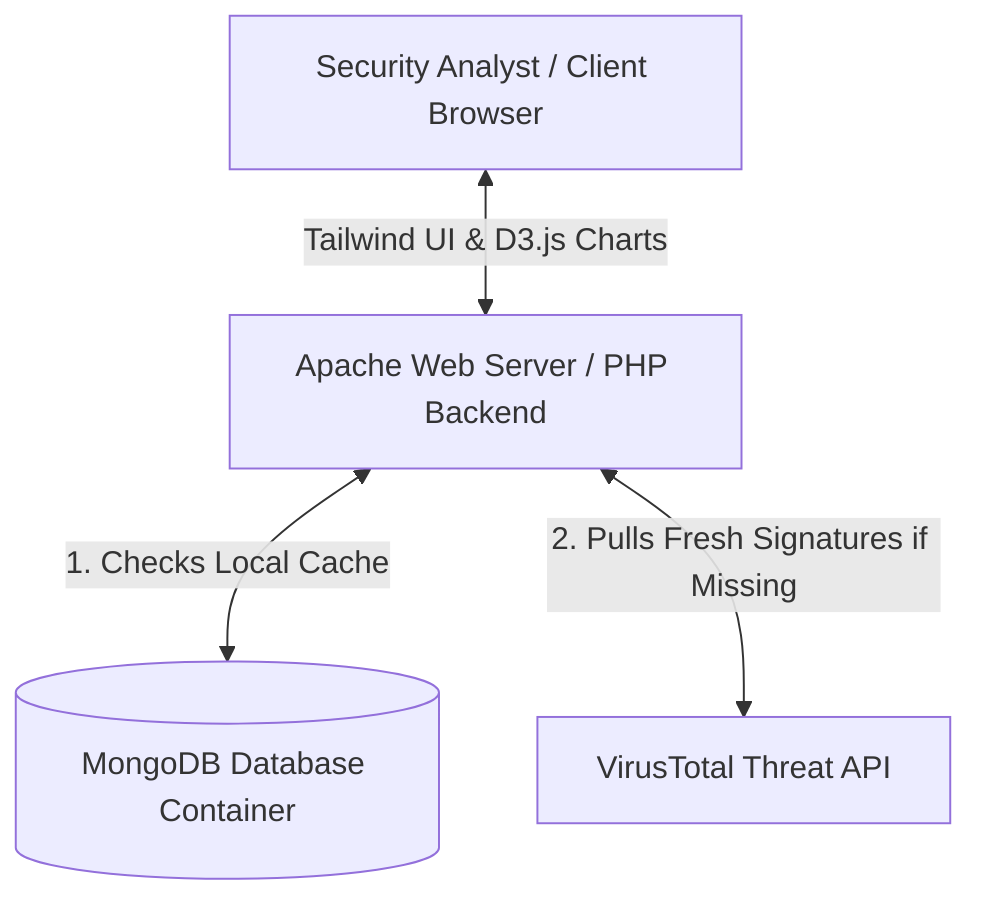

# 🛡️ MalCom — Malware Comparison & Similarity Analysis Tool

[](https://www.php.net/)
[](https://www.mongodb.com/)
[](https://www.docker.com/)
[](LICENSE)

**MalCom** is a containerized, full-stack cybersecurity analysis platform designed to aggregate, compare, and visualize threat intelligence and behavioral reports for multiple malware samples. By leveraging the **VirusTotal API** and a robust local **MongoDB** caching layer, MalCom equips threat analysts and researchers with the tools to dissect malware properties, spawn graphs, loaded libraries, and anti-virus verdicts side-by-side.

---

## 🌟 Key Features

* **Multi-Malware Side-by-Side Comparison:** Compare up to 4 MD5 malware hashes simultaneously in an interactive grid highlighting shared behavioral signatures (loaded libraries, API calls, files altered).
* **VirusTotal API Integration:** Dynamically fetches deep-dive behavioral reports, metadata, antivirus votes, and system interactions directly from VirusTotal's threat engine.
* **Smart NoSQL Caching Layer:** Caches all queried malware signatures locally in **MongoDB** to minimize external network latency and bypass API rate limits.
* **Interactive D3.js Visualizations:** Renders high-fidelity, responsive data-driven SVGs that mathematically map matching features and analyze process creation/termination timelines.
* **Category Filtering:** Filter large comparison datasets on-the-fly (e.g. isolate loaded libraries, active processes, anti-virus verdicts) through a responsive Tailwind control panel.
* **CSV Export & Portability:** Download normalized comparative tables directly in standard **CSV format** for external ingestion and offline analysis.
* **Premium Glassmorphic Design:** Built with a state-of-the-art dark theme, responsive grid layouts, custom slide-transition panels, and fluid micro-animations.

---

## 🧪 Tech Stack

* **Frontend:** HTML5, CSS3, **Tailwind CSS** (v3), **D3.js** (Data-driven SVGs), FontAwesome 6, JavaScript (ES6+, AJAX)
* **Backend:** **PHP** (Model-View-Controller patterns, robust error handling & session management)
* **Database:** **MongoDB** (NoSQL datastore with customized robust connection fail-safes)
* **Containerization & Devops:** **Docker** & **Docker Compose**
* **External APIs:** **VirusTotal API v3**

---

## 📐 Platform Architecture



---

## 🚀 Installation & Getting Started

### 📋 Prerequisites
Ensure you have the following installed on your host machine:
* [Docker](https://www.docker.com/get-started)
* [Docker Compose](https://docs.docker.com/compose/install/)

### 🛠️ Configuration
1. Clone this repository to your local workspace:
   ```bash
   git clone https://github.com/matanmay/virus-comparison.git
   cd virus-comparison
   ```

2. Create a `.env` file in the root directory and configure your connection strings and VirusTotal API Key:
   ```env
   # MongoDB Connection String (Points to the containerized database)
   MONGODB_URL=mongodb://root:password@db:27017/malware_db?authSource=admin

   # VirusTotal API Key (V3)
   VIRTUSTOTAL_API=your_virustotal_api_key_here
   ```

### 🐳 Running with Docker
1. Fire up the multi-container environment (starts the Apache/PHP web container and MongoDB server):
   ```bash
   docker-compose up --build
   ```

2. Once the build finishes and the containers are healthy, access the platform in your browser at:
   ```
   http://localhost:8080
   ```

3. (Optional) To clear the cached database and start with a completely empty, fresh state:
   ```bash
   docker exec -i malware-comparison-db mongosh -u root -p password --eval "db.getSiblingDB('malware_db').malweres.drop()"
   ```

---

## 👥 Authors & Team
Developed as a BSc. Final Year Project by:
* **Matan Mayerowicz**
* **Roei Kriger**
* **Noga Dembinsky**

---
